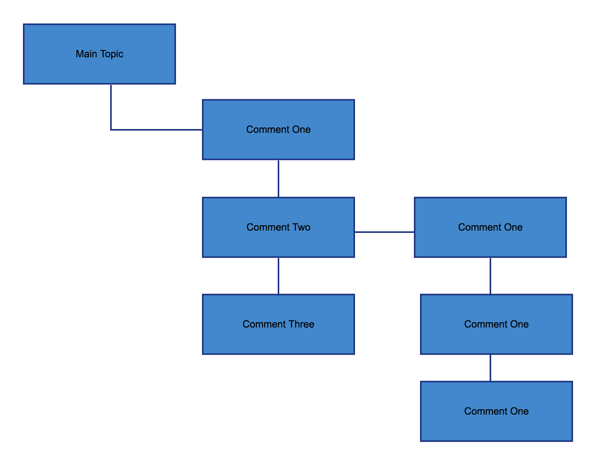

# Discussion

[![Latest Version on Packagist][ico-version]][link-packagist]
[![Total Downloads][ico-downloads]][link-downloads]



Discussion is nested discussion with approve/disapprove feature. Discussion inside the discussion, like the above image.

Take a look at [contributing.md](contributing.md) to see a to do list.

## Installation

Via Composer

``` bash
$ composer require carropublic/discussion
```

The package will automatically register itself.

You can publish the migration with:

```bash
php artisan vendor:publish --provider="CarroPublic\Discussion\DiscussionServiceProvider" --tag="migrations"
```

After the migration has been published you can create the media-table by running the migrations:

```bash
php artisan migrate
```

You can publish the config-file with:

```bash
php artisan vendor:publish --provider="CarroPublic\Discussion\DiscussionServiceProvider" --tag="config"
```

## Usage

Get lists of discussions which approve. 

```bash
$post->discussions()->approve()->get()
```

Get lists of discussions which got disapprove. 

```bash
$post->discussions()->disApproved()->get()
```

Get lists of discussions for both approve and disapprove.

```bash
$post->discussions
```

### Register the Model

In order to receive/retrieve discussions from the specific model, add the `HasDiscussion` trait to the model class. In our case we choose `Post` as main discussion.

``` php
namespace App\Models;

use Illuminate\Database\Eloquent\Model;
use CarroPublic\Discussion\Traits\HasDiscussion;

class Post extends Model
{
    use HasDiscussion;
    ...
}
```

### Create Discussions

To create a discussion to your discussable models (in this case Post model), you can use `discussion` method like the following.

``` php
$post = Post::find(1);
$post->discussion('Hello World! This is a discussion');
```

You can also use `discussAsUser` method which need to pass the user object. See example in the following.

``` php
$user = User::find(1);
$post->discussAsUser($user, 'Hi! This is a simple discussion');
```

### Retrieving Discussion

After you finish creating discussion, You can retrieve all your discussion like the following.

``` php
$post->discussions

```

You can filter only by approve or disapprove like the following.

``` php
#For approve discussion
$post->discussions()->approved()->get();

#For disapprove discussion
$post->discussions()->disApproved()->get();
```

## Change log

Please see the [changelog](changelog.md) for more information on what has changed recently.

## Testing

``` bash
$ composer test
```

## Contributing

Please see [contributing.md](contributing.md) for details and a todolist.

## Security

If you discover any security related issues, please email author email instead of using the issue tracker.

## Credits

- [Carro][link-author]
- [All Contributors][link-contributors]
- [Laravel Comment][link-laravel-comment-package]

Take Lots of reference from [Laravel Comment][link-laravel-comment-package] package. And modify base on what our need.

## License

license. Please see the [license file](license.md) for more information.

[ico-version]: https://img.shields.io/packagist/v/carropublic/discussion.svg?style=flat-square
[ico-downloads]: https://img.shields.io/packagist/dt/carropublic/discussion.svg?style=flat-square
[ico-travis]: https://img.shields.io/travis/carropublic/discussion/master.svg?style=flat-square
[ico-styleci]: https://styleci.io/repos/12345678/shield

[link-packagist]: https://packagist.org/packages/carropublic/discussion
[link-downloads]: https://packagist.org/packages/carropublic/discussion
[link-author]: https://github.com/carropublic
[link-contributors]: ../../contributors
[link-laravel-comment-package]: https://github.com/beyondcode/laravel-comments